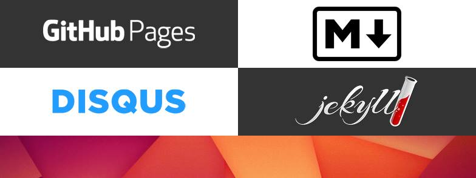

# Workshop: GitHub Pages

These are the notes for a workshop I conducted at the [Lernwerkstatt](http://www.die-lernwerkstatt.org/) in Berlin on May 8th, 2016, and are meant as a reference for its participants.
Should it facilitate autonomous learning for anybody else – even better!
A [presentation is available](http://stieben.github.io/workshop-gh-pages/) as well.

## Table of contents

1. [Introduction](#1-introduction)
  - [Requirements](#requirements)
2. [Publishing for everybody!](#2-publishing-for-everybody)
3. [Git](#3-git)
4. [GitHub](#4-github)
  - [Hello world!](#hello-world)
  - [Manage your projects with GitHub Desktop](#manage-your-projects-with-github-desktop)
5. [Advanced text editing with Atom](#5-advanced-text-editing-with-atom)
6. [Create a blog with Jekyll](#6-create-a-blog-with-jekyll)
7. [Write your first blog post](#7-write-your-first-blog-post)
  - [Meta information](#meta-information)
  - [Formatting text with Markdown](#formatting-text-with-markdown)

---

- [A deeper look at the HPSTR theme](#a-deeper-look-at-the-hpstr-theme)
- [Connecting a custom domain](#connecting-a-custom-domain)
  - [Free domains](#free-domains)


- [Last words](#last-words)
  - [Thanks](#thanks)
- [More information](#more-information)
- [License](#license)



## 1. Introduction

Nowadays, anyone can publish a free website within hours, without necessarily being very tech-savvy.
I'd like to prove this during the workshop in a quite practical manner.
It is aimed at beginners or people without much technical expertise.

After a short overview about the possibilities and a little bit of theory, we'll dive into a specific example.
At the end of the workshop, you will be online with a working website – something like a blog.
But at that point you should have gotten an idea of how to create differents sorts of websites.

We'll be using GitHub Pages, Markdown, Jekyll and Disqus.
This selection of technologies is a good tradeoff – we will need to talk about a couple of technical things, but it gives us a lot of freedom in the long run.

### Requirements

- No HTML skills required
- Curiosity about web technologies
- Windows, Mac or Linux

## 2. Publishing for everybody!

Publishing on the web can be a cheap and easy thing to do, depending on how much you value ease of use, customization, data ownership or price.
Let's take a look at the wide spectrum of possibilities, more or less ranging from super easy to super flexible:

| Type                | Example                                   | Pro                                  | Con                                |
| ------------------- | ----------------------------------------- | ------------------------------------ | ---------------------------------- |
| Social network      | [Facebook](https://www.facebook.com/)     | Blogging with notes; groups & pages  | Closed platform; FB owns your data |
| Publishing platform | [Medium](https://medium.com/)             | Ease of use; social journalism       | Limited to articles; one UI design |
| Website builder     | [Weebly](https://www.weebly.com/)         | Ease of use; different website types | Not all features are free          |
| Blogging platform   | [Wordpress](https://wordpress.com/)       | Can be self-hosted; themes & plugins | Modification requires tech skills  |
| Static site         | [GitHub Pages](https://pages.github.com/) | Themes, can be totally customized    | Markup language; setup required    |
| Web hosting         | [Uberspace](https://uberspace.de/)        | Use databases and popular scripts    | Costs money; tech skills needed    |
| Root server         | [netcup](https://www.netcup.de/)          | Install anything you like            | Maintenance; security; difficulty  |
| Home server         | [Debian](https://www.debian.org/)         | Complete freedom & ownership         | Complete responsibility            |

## 3. Git


Git is a distributed version control system.
What does that mean?

- Git is software.
- Git is a version control system.
  It allows changes to your documents to be organized in revisions so that you can go look and even revert to a past revision at any point in time.
- Git is also distributed.
  Put simply, it allows multiple people to collaborate on the same documents.

## 4. GitHub


While Git is traditionally aimed at a technical audience, GitHub helps making the use of Git more or less a breeze. What exactly is it? It's a web-based Git repository hosting service:

- GitHub is a user interface that lets you do Git things without the need to write and execute Git commands.
- GitHub is hosting repositories.
- Repositories are like projects.
  You can create and work on as many projects as you like.
- It's all free to use for [open source](https://github.com/open-source) projects.
- GitHub is also a bit of a social network and offers several collaboration features, like task management and wikis.
- You can follow other people, save their projects (both bookmark and copy), or collaborate with them (ask questions, request or suggest changes).
- GitHub facilitates documentation (like this very document).
- GitHub Pages are a way of publishing websites from within a repository.
  This is what we are going to do now.

### Hello world!

Let's get going.
You'll have a working website within minutes:

1. Navigate to the [GitHub homepage](https://github.com/) to sign up.
  - Choose a username.
   Small letters, numerals and hyphens allowed.
  - Enter a valid e-mail address.
  - Choose a passphrase. At least: 7 characters, one letter, one numeral.
2. On the second page, the free plan is already chosen.
   Just _finish sign up_.
3. Check your inbox.
   Click the link in the confirmation e-mail to verify your e-mail address.
4. Create a _new repository_.
  - Repository name must be: `<your-username>.github.io`
5. Create a new file on your computer called `index.htm`.
   Open it with a text editor, write `Hello world!` and save it.
   Standard text editors are:
  - _Notepad_ on _Windows_
  - _TextEdit_ on _Mac OS X_
  - _gedit_, _KWrite_ or _Leafpad_ on _Linux_
6. Take the file and drop it into the repository.
  - A commit page appears.
  - A commit bundles coherent changes to your project.
  - Enter a commit summary, like `Hello world!`, into the upper input field and then _commit changes_.
7. Navigate to `<your-username>.github.io`.
   Your website is already online.

### Manage your projects with GitHub Desktop

Dropping a file onto the repository, like you did with the `index.htm` file before, may be suitable for small changes, but it's not ideal for more complex updates.
The usual workflow would be to have a local copy of your project (this means having a folder on your computer containing the repository files) and keep track of the changes with a Git user interface.

_GitHub Desktop_ is such a user interface.
It's available for _Windows_ and _Mac OS X_ and recommended for beginners.
If you happen to have a _Linux_ installed on your system, I'd recommend [SmartGit](http://www.syntevo.com/smartgit/).
We'll be focussing on GitHub Desktop, though.
Let's set it up:

1. Navigate to the [GitHub Desktop homepage](https://desktop.github.com/).
2. Download and install it.
   It may start automatically after installation.
3. Sign in.
   The configuration should be filled out already.
   Continue.
4. In the _repositories_ windows, just _skip_.
5. Now, in the main window, push the `+` button to _clone_ your repository.
  - Choose a folder on your system to copy into.
6. _Open this repo in explorer_.
  - You should see that same `index.htm` you uploaded earlier.

## 5. Advanced text editing with Atom


During this workshop, you are going to create and edit more text files.
While you could do that with the basic text editor of your system, a slightly more advanced editor, like _Atom_ or _Sublime Text_, is recommended.
Atom was initiated by GitHub and provides useful features like syntax highlighting, tabs, a file browser, themes, and more things that can be added via plugins.
So let's go get it:

1. Navigate to the [Atom website](https://atom.io/).
2. Download and install the editor.
   It may open automatically after installation.
3. `File > Add Project Folder…`
  - You should see the _tree view_.
  - If not, select `View > Toggle Tree View`.
4. Click on the little arrow on the left of the folder name to expand.
5. Again, you should see that same `index.htm` you know so well already.
  - Delete that file.
    We don't need it anymore.

## 6. Create a blog with Jekyll

_GitHub Pages_ are powered by [Jekyll](http://jekyllrb.com/).
Jekyll is a so called static site generator.
It helps you combine different components into a set of web pages.
Confusing?
Don't worry – you don't have to touch anything Jekyll if you don't want to.
There's ready-made themes available for you to use for free, for example at [JekyllThemes.io](https://jekyllthemes.io/).
Let's try one:

1. Download [the HPSTR theme](https://github.com/mmistakes/jekyll-theme-hpstr/archive/refs/tags/1.7.6.zip).
2. Open the ZIP archive and copy the contents of the _jekyll-theme-hpstr-1.7.6_ folder to your project folder.
  - When done, you may delete that ZIP file.

Now, before creating your first blog post, let's make sure that theme actually works:

1. Switch to GitHub Desktop.
  - As you can see, it shows you the number of changes to your project.
2. Enter a commit summary, like `Added Jekyll HPSTR theme`.
  - A meaningful summary helps you and your potential collaborators identify different revisions of your project in the future.
3. _Commit_ to create an update.
4. _Sync_ to upload your commits to GitHub.
5. Navigate to `<your-username>.github.io`.
   Now isn't that beautiful.

## 7. Write your first blog post

We are now going to start blogging.
First, navigate to your project folder.
You will notice another folder inside called `_posts`.
Inside this folder, you will find 8 sample posts.
Delete them – let's have a clean start.
Remember that Git keeps all of your revisions for future reference?
The second revision of your project will always contain those 8 sample posts, so it's safe to delete them now.
If you ever get curious just take a look at the revision history to see how the sample posts have been made.

Inside the `_posts` folder, create a new file.
It should have the following structure:

`YYYY-MM-DD-friendly-url.md`

The date is used for sorting the blog posts; the part after determines the path inside the URL.
The file extension, `md`, is for _Markdown_; we will take a look at Markdown in a moment.
A good example for a file name may be:

`2016-05-08-hello-world.md`

Open the file in Atom.

### Meta information

At the top of the file, add the following information:

```yaml
---
layout: post
title: "Hello world!"
description: "This is my first blog post."
tags: [exploring markdown, intro, test]
---
```

This part is written in `YAML` but that isn't anything you need to worry about.
Insert a blank line after the meta block – next up is Markdown.

### Formatting text with Markdown

[Wikipedia](https://en.wikipedia.org/wiki/Markdown) says:

> Markdown is a lightweight markup language with plain text formatting syntax

Lightweight means easy!
You don't need to know HTML to format your pages – but you can!
Inside a Markdown document, you cannot only use Markdown itself but arbitrary HTML as well.

Check out this [GitHub guide about Markdown](https://guides.github.com/features/mastering-markdown/) to get started.

When you're done writing your first post, switch to GitHub Desktop, review your changes, write a commit summary, commit your changes and sync to upload them to GitHub.

---

## A deeper look at the HPSTR theme

There's a couple of interesting files and folders we may pay attention to:

- **_layouts/**: If you want to customize the structure of your pages this is where you need to look.
  The thing is – you need to know a bit or two about HTML and Jekyll to understand what is going on in here.
  Usually, you just leave this folder alone.
- **_posts/**: This folder has been described before; see section [7. Write your first blog post](#7-write-your-first-blog-post).
- **_sass/**: Contains the style definitions.
  You need knowledge about _SCSS_ to change them.
- **about/**: Use this page to tell your visitors about your website.
  You can access it via the menu.
- **images/**: Put your image files here.
- **404.md**: This page is shown whenever the user tries to access a page that doesn't exist.
- **_config.yml**: Take a look at this file to change basic information about your website.

## Connecting a custom domain

If `<your-username>.github.io` isn't enough, you can connect your website with a custom domain.
If you haven't registered a domain already, you should do that now, for example at [DomainFactory](https://www.df.eu/).
[GitHub has written an article about how to proceed.](https://help.github.com/articles/quick-start-setting-up-a-custom-domain/)

### Free domains

[Freenom](http://www.freenom.com/en/freeandpaiddomains.html) offers 5 free domain TLDs:

- [.tk](https://en.wikipedia.org/wiki/.tk)
- [.ml](https://en.wikipedia.org/wiki/.ml)
- [.ga](https://en.wikipedia.org/wiki/.ga)
- [.cf](https://en.wikipedia.org/wiki/.cf)
- [.gq](https://en.wikipedia.org/wiki/.gq)

There's just one catch: Registrants of a free domain don't become owners of that domain which means that you don't have the same rights as usual.
For example, [their FAQ page states](http://www.freenom.com/en/support.html):

> For FREE domain names you can register domains for 1 to 12 months.
> You can renew FREE domain names in the last 15 days of each registration period – 15 days before the expiration date.
>
> (...)
>
> If your website is down for a prolonged period or if your content is unacceptable/not uploaded the domain will be cancelled.
> Your domain name might then become automatically available for other registrants to register either as a free or as a paid registration.

## Last words

To keep this workshop documentation as a reference, I'd recommend starring this repository.
You can do this at the top right of this page; it adds a bookmark to your profile.
Watching it means you get notifications whenever it's updated.

If a question comes up you are always welcome to start a [discussion](https://github.com/stieben/workshop-gh-pages/discussions).

### Thanks

Thanks to [@hnz101](https://github.com/hnz101) for pointing me to _Freenom_.

## More information

[HPSTR theme repository](https://github.com/mmistakes/jekyll-theme-hpstr)

## License

&copy; 2021 Andrej Stieben – for this workshop  
&copy; 2015 Ian Lunn Design Limited – for [Sequence.js](http://www.sequencejs.com/) and its [Starter Basic theme](http://www.sequencejs.com/themes/starter-basic/)

This repository is made available under the [CC BY-NC 4.0](http://creativecommons.org/licenses/by-nc/4.0/) license.
