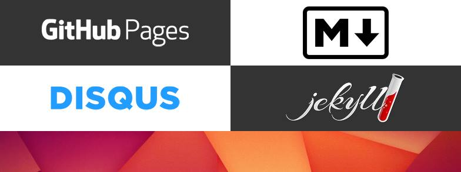

# Workshop: GitHub Pages

These are notes for a workshop at the [Lernwerkstatt](http://www.die-lernwerkstatt.org/) in Berlin on May 8th, 2016, and are meant as a reference for its participants.

## Table of contents

1. Introduction
  - Requirements
2. Publishing for everybody!
3. Git
4. GitHub
5. Advanced text editing with Atom

## 1. Introduction

Nowadays, anyone can publish a free website within hours, without necessarily being very tech-savvy.
I'd like to prove this during the workshop in a quite practical manner.
It is aimed at beginners or people without much technical expertise.

After a short overview about the possibilities and a little bit of theory, we'll dive into a specific example.
At the end of the workshop, you will be online with a working website – something like a blog.
But at that point you should have gotten an idea of how to create differents sorts of websites.

We'll be using GitHub Pages, Markdown, Jekyll and Disqus.
This selection of technologies is a good tradeoff – we will need to talk about a couple of technical things, but it gives us a lot of freedom in the long run.

### Requirements

- No HTML skills required
- Curiosity about web technologies
- Windows, Mac or Linux

## 2. Publishing for everybody!

Publishing on the web can be a cheap and easy thing to do, depending on how much you value customization, data ownership or price.
Let's take a look at the wide spectrum of possibilities, more or less ranging from super easy to super flexible:

| Type                | Example      | Pro                                   | Con                                  |
| ------------------- | ------------ | ------------------------------------- | ------------------------------------ |
| Social network      | Facebook     | Blogging with notes; groups and pages | Closed platform; FB owns your data   |
| Publishing platform | Medium       | Ease of use; social journalism        | Limited to articles; one UI design   |
| Website builder     | Weebly       | Ease of use; different website types  | Ads; not all features are free       |
| Blogging platform   | Wordpress    | Can be self-hosted; themes & plugins  | Modification requires tech skills    |
| Static site         | GitHub Pages | Themes, can be completely customized  | Markup language; setup required      |
| Web hosting         | Uberspace    | Use databases and popular scripts     | Costs money; some tech skills needed |
| Root server         | netcup       | Install anything you like             | Maintenance; security; difficulty    |
| Home server         | Debian       | Complete freedom & ownership          | Complete responsibility              |

## 3. Git

Git is a distributed version control system.
What does that mean?

- Git is software.
- Git is a version control system.
  It allows changes to your documents to be organized in revisions so that you can go look and even revert to a past revision at any point in time.
- Git is also distributed.
  Put simply, it allows multiple people to collaborate on the same documents.

## 4. GitHub

While Git is traditionally aimed at a technical audience, GitHub helps making the use of Git more or less a breeze.

## 5. Advanced text editing with Atom

During this workshop, you are going to create and edit text files.
While you could do that with the basic text editor of your system, a slightly more advanced editor, like _Atom_ or _Sublime Text_, is recommended.
Atom was initiated by GitHub and provides useful features like syntax highlighting, tabs, a file browser, themes, and more things that can be added via plugins.
So let's go get it:

1. Navigate to the [Atom website](https://atom.io/).
2. Download and install the editor.
   It may open automatically after installation.

## License

&copy; 2016 Andrej Stieben

This repository is licensed under the [CC BY-NC 4.0](http://creativecommons.org/licenses/by-nc/4.0/) license.
